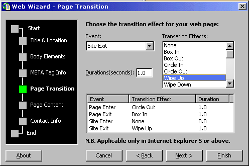



## Web Wizard v3\.37\( New, Improved and fixed \)

### Description

Web Wizard v3.37

The amazing, cool web page creating proggie Web Wizard is back with it's new, improved and easy-to-use interface.Now you can explore the six steps for creating your web page easily and select various options by clicking them. It's now featuring the following steps :

Title & Location,

Body Elements,

META Tags,

Page Transtitions,

Page Contents,

Contact Info,

By following the steps, it's very easy to create web pages in minutes. It's too handy to use and you will feel using it. See the screen shot to have a quick look. If you like it, then please vote for me.
 
### More Info
 

             |
---                |---
**Submitted On**   |2001-04-20 19:29:48
**By**             |[Md Emran Hasan](https://github.com/Planet-Source-Code/PSCIndex/blob/master/ByAuthor/md-emran-hasan.md)
**Level**          |Intermediate
**User Rating**    |4.9 (39 globes from 8 users)
**Compatibility**  |VB 5\.0, VB 6\.0
**Category**       |[Complete Applications](https://github.com/Planet-Source-Code/PSCIndex/blob/master/ByCategory/complete-applications__1-27.md)
**World**          |[Visual Basic](https://github.com/Planet-Source-Code/PSCIndex/blob/master/ByWorld/visual-basic.md)
**Archive File**   |[Web Wizard185934202001\.zip](https://github.com/Planet-Source-Code/md-emran-hasan-web-wizard-v3-37-new-improved-and-fixed__1-22521/archive/master.zip)

